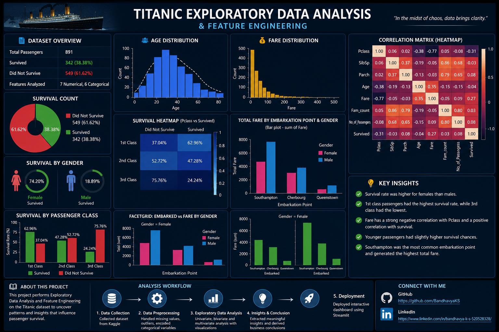

# 🚢 Titanic Exploratory Data Analysis & Feature Engineering

<p align="center">
  
</p>

## 📌 Project Overview

This project performs **Exploratory Data Analysis (EDA)** and **Feature Engineering** on the Titanic dataset to uncover meaningful insights about passenger demographics, travel patterns, fare distribution, and survival factors.

The project demonstrates a complete data analytics workflow, including data cleaning, preprocessing, visualization, correlation analysis, and feature engineering.

---

## 🎯 Objectives

- Understand passenger demographics
- Handle missing values and data inconsistencies
- Detect and analyze outliers
- Perform feature engineering
- Visualize passenger travel patterns
- Identify factors influencing passenger survival

---

## 📂 Dataset Information

- **Dataset:** Titanic Dataset
- **Source:** Kaggle
- **Records:** 891 Passengers
- **Target Variable:** Survived

---

## 🛠️ Technologies Used

- Python
- Pandas
- NumPy
- Matplotlib
- Seaborn
- Jupyter Notebook

---

## 📊 Exploratory Data Analysis

The project includes the following analyses:

- Data Cleaning
- Missing Value Handling
- Outlier Detection
- Feature Engineering
- Passenger Age Distribution
- Fare Distribution
- Passenger Class Analysis
- Gender Analysis
- Travel Pattern Analysis
- Correlation Matrix
- Heatmap
- Scatter Plot
- FacetGrid Visualization

---

## 📈 Key Insights

- Female passengers had a higher survival rate than male passengers.
- First-class passengers showed the highest survival probability.
- Southampton was the busiest embarkation point.
- Passenger Class and Fare exhibited a strong negative correlation.
- Most passengers were between 20 and 50 years of age.
- Fare distribution was highly skewed with a few high-value outliers.

---

## 📁 Repository Structure

```
Titanic-Exploratory-Data-Analysis-and-Feature-Engineering/
│
├── Titanic_Data-Analytics.ipynb
├── dashboard.png
├── README.md
└── dataset.csv
```

---

## 🚀 Project Workflow

1. Data Collection
2. Data Cleaning
3. Data Preprocessing
4. Feature Engineering
5. Exploratory Data Analysis
6. Data Visualization
7. Insights & Conclusions

---

## 👩‍💻 Author

**Bandhavya K.S.**

📧 Aspiring Data Analyst | Data Scientist

### 🔗 Connect with Me

**GitHub**

https://github.com/BandhavyaKS

**LinkedIn**

https://www.linkedin.com/in/bandhavya-k-s-520528328/

**Project Repository**

https://github.com/BandhavyaKS/Titanic-Exploratory-Data-Analysis-and-Feature-Engineering

---

⭐ If you found this project useful, consider giving it a **Star** on GitHub!